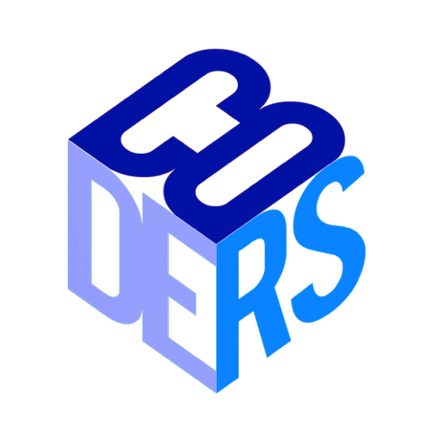

  <h1>CODERS Club - Website Research Project</h1>
  
   
  <em>Welcome to the CODERS Club Website GitHub repository! This website serves as the central hub for our vibrant community of coding enthusiasts at our college.</em>
   
  

    <a href="./INSTALL.md">Installation</a> &bull; <a href="./DEVELOPMENT.md">Development</a> &bull; <a href="./SECURITY.md">Security</a> &bull; <a href="#need-help">Contact</a>
  

## Website Structure & What To Know to Contribute

Our website is built using the following technologies. I highly suggest you learn about or at least get a feel for:

- **HTML** for structure
- **CSS, SCSS** for styling
- **JavaScript/TypeScript** for interactivity
- **Angular Service** for Dynamic Website Modification and Deployment

To get started, set up your development environment using the [Installation Guide](./INSTALL.md) and once you are ready to contribute, see the [Development Guide](./DEVELOPMENT.md) for details.

## Further Reading & Resources

### HTML

- [MDN Web Docs](https://developer.mozilla.org/en-US/docs/Web/HTML)
- [freeCodeCamp](https://www.freecodecamp.org/)

### CSS

- [MDN Web Docs](https://developer.mozilla.org/en-US/docs/Web/CSS)
- [freeCodeCamp](https://www.freecodecamp.org/)

### JavaScript

- [MDN Web Docs](https://developer.mozilla.org/en-US/docs/Web/JavaScript)
- [Eloquent JavaScript](https://eloquentjavascript.net/)

### TypeScript

- [Official Documentation](https://www.typescriptlang.org/)

### Angular

- [Official Documentation](https://angular.io/docs)

## Need help?

If you have any questions, concerns, or need anything, please contact Brendan Lambrecht at lambrecht5083@uwlax.edu or via [Snapchat](https://snapchat.com/add/bren-dog2020).